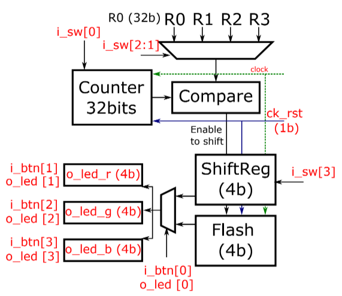

# EAMTA 2021 - Digital Design

## Laboratorio 1
El objetivo es realizar la implementación de elementos básicos en FPGA usando Verilog.

### Descripción de la aplicación
Implementación de un controlador de LEDs en la FPGA tomando como referencia el diseño de la figura.

- Los nombres en rojo son puertos.
- ck_rst es el reset del sistema, el cual pone a cero el contador e inicializa el shiftregister (SR) con algún valor de salida en 1 y el bloque flash (FS) con todos los valores de salida en 1. Además, el reset es asíncrono y el pulsador es normal-cerrado.
- i_sw[0] controla el enable (1) del contador. En estado (0) todo se detiene sin alterar el estado actual del contador y del SR/FS.
- El pulsador i_btn[0] elije el modo de trabajo de los LEDs RGB. Cada vez que se pulsa el modo cambia entre SR o FS.
- Modo shiftregister:
    - Se desplaza únicamente cuando el contador llegó a algún límite R0-R3 seleccionado a través de i_sw[2:1].
    - La dirección de desplazamiento se selecciona con i_sw[3].
- Modo flash:
    - La salida cambia de estado cada vez que se llega al límite del contador. Ejemplo, el contador llega a R0 la salida esta en 1, cuando el contador cuelce a llegar a R0 la salida cambia a 0.
- La elección del límite se puede realizar en cualquier momento del funcionamiento.
- Los pulsadores i_btn[3:1] eligen el color de salida de los RGB. Es decir, cada vez que se pulsa alguno de los botones se pasa a rojo o verde o azul. Si se aprieta más de una vez el mismo pulsador, el LED debe permanecer del mismo color.
- Además, se debe encender un LED (o_leds[3:0]) según el pulsador que se haya apretado.

### Consideraciones
Tener en cuenta que el pulsador i_btn[3:0] regresa al estado inicial siempre que se suelta.

Asumir que las entradas de pulsadores y llaves no requieren de sincronización ni circuito antirebotes (se consideran síncronas).
