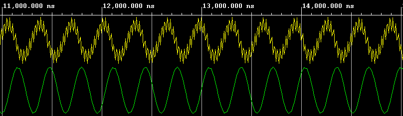
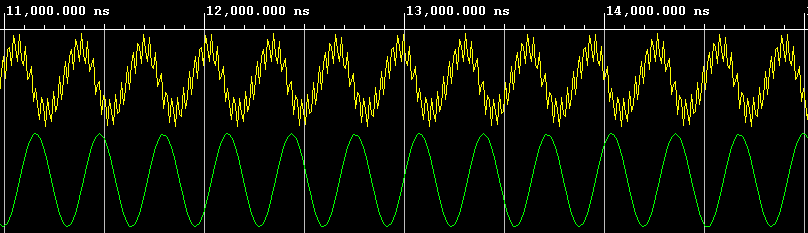
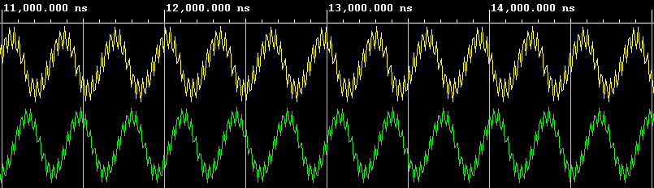
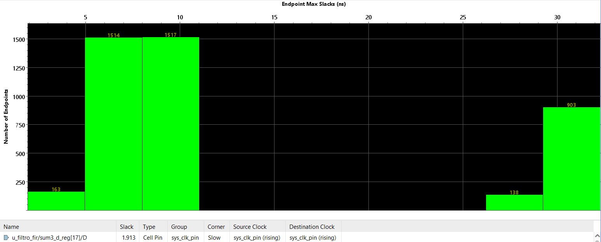
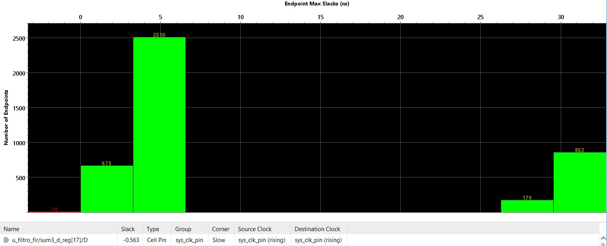
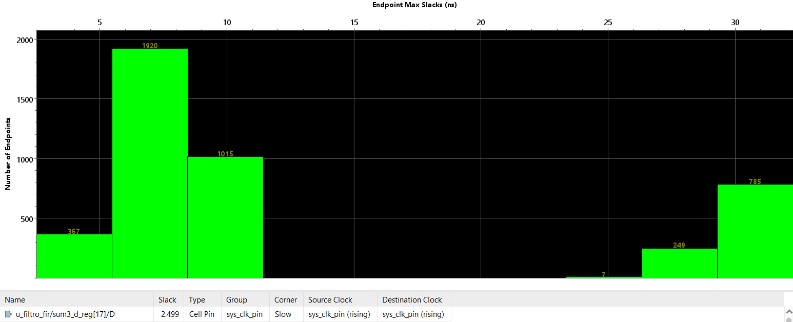
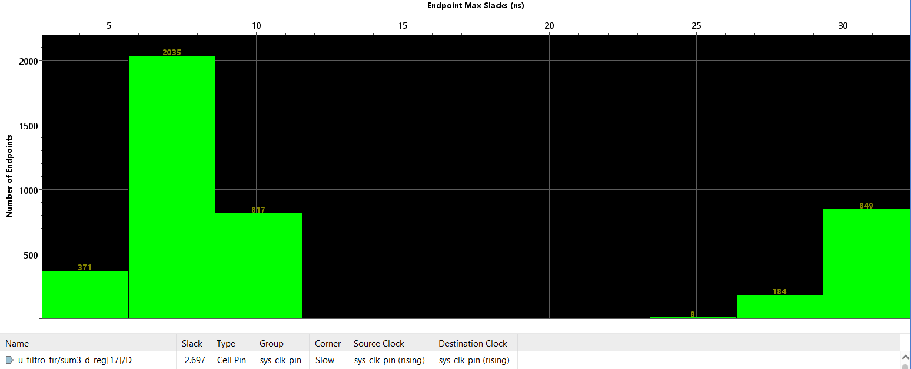
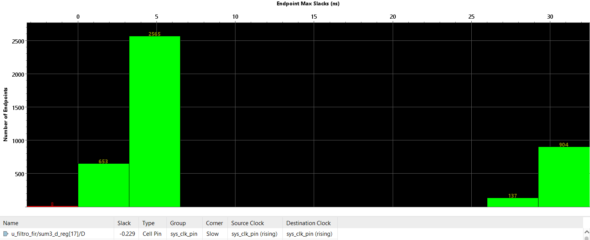

# EAMTA 2021 - Digital Design

## Laboratorio 2
El objetivo es realizar la implementación de un filtro FIR y análisis de reportes de timing.

Se considera un sistema de transmisión compuesto por una señal senoidal y un filtro pasa bajo con las siguientes características:
- Señal senoidal compuesta por dos frecuencias f1=17kHz (ruido) y f2=1,5kHz
- Frecuencia de muestreo fs=48kHz
- Filtro pasa bajo con frecuencia de corte fcut=6kHz

### Simulación

Desarrollo del testbench para verificar el funcionamiento del modelo (archivo [tb_filtro_fir.v](./tb_filtro_fir.v)).

Modificación de los coeficientes del filtro para las frecuencias de corte fcut=8kHz y fcut=18kHZ y comparación de la salida del filtro para cada una de esas frecuencias.

| fcut  | Sañal generada (amarillo) y señal filtrada (verde) |
|-------|----------------------------------------------------|
| 6kHz  |                   |
| 8kHz  |                   |
| 18kHz |                  |

Se puede observar que para una frecuencia de corte del filtro de 18kHz no se filtra el ruido por ser de 17kHz.

### Síntesis

Detalle de celdas por jerarquías: 

|      |Instance             |Module           |Cells 6kHz | Cells 8kHz | Cells 18kHz |
|------|---------------------|-----------------|----------:|-----------:|------------:|
|1     |top                  |                 |        618|         591|          662|
|2     |  u_signal_generator |signal_generator |        237|         327|          237|
|3     |  u_filtro_fir       |filtro_fir       |        377|         350|          421|
|4     |  u_vio              |vio              |          1|           1|            1|

Se puede observar cómo para una frecuencia de corte del filtro de 8kHz la cantidad de celdas utilizadas es menor que para 6kHz. Se puede analizar con mayor detalle las celdas utilizadas en cada caso en los logs de síntesis en la carpetada de [logs](./logs), allí es importante destacar que, por ejemplo, para 8kHz se utilizan mayor cantidad de *CARRY4* que para 6kHz.

### Implementación

Comparación de slack:

| fclk | fcut | Worst Negative Slack (WNS) | Total Negative Slack (TNS) | Worst Hold Slack (WHS) | Worst Pulse Width Slack (WPWS) |
|------|------|----------------------------|----------------------------|------------------------|--------------------------------|
|100MHz|6kHz  | 1.913 ns                   | 0.000 ns                   | 0.025 ns               | 3.750 ns                       |
|150MHz|6kHz  | **-0.563 ns**              | **-4.803 ns**              | 0.000 ns               | 0.000 ns                       |
|100MHz|8kHz  | 2.499 ns                   | 0.000 ns                   | 0.037 ns               | 3.750 ns                       |
|150MHz|8kHz  | **-0.011 ns**              | **-0.015 ns**              | 0.027 ns               | 2.080 ns                       |
|100MHz|18kHz | 2.697 ns                   | 0.000 ns                   | 0.029 ns               | 3.750 ns                       |
|150MHz|18kHz | **-0.229 ns**              | **-0.968 ns**              | 0.025 ns               | 2.080 ns                       |

Comparación de histogramas de slack:

| fclk | fcut | Histograma                                                 |
|------|------|------------------------------------------------------------|
|100MHz|6kHz  |                  | 
|150MHz|6kHz  |                          |
|100MHz|8kHz  |                  | 
|150MHz|8kHz  |                  |
|100MHz|18kHz |                 | 
|150MHz|18kHz |                 |

Se puede observar que para 150MHz para ninguna de las frecuencias de corte del filtro se cumplen los requisitos de timing (sin utilizar ninguna estrategia de optimización en el proceso de implementación).

También se añadió los IPs VIO e ILA para controlar en forma remota el diseño (solo se utilizó para el set de coeficientes de 8kHz), pueden observarse las instancias de dichos
IPs en el archivo [top_design.v](./top_design.v).
