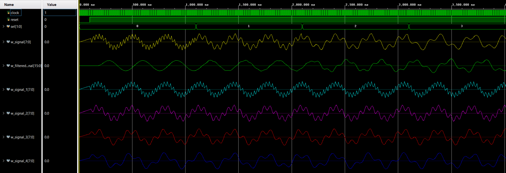
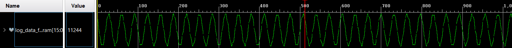

# EAMTA 2021 - Digital Design

## Laboratorio 3
El objetivo es realzar la integración del filtro FIR con la memoria BRAM.

Se implementó un generador de señales con la capacidad de transmitir cuatro tipos de señales donde la frecuencia de muestreo es fs=48kHz:
- Señal 1: f1=1,5kHz y f2=17kHz (archivo [mem17khz.hex](./signals/mem17khz.hex))
- Señal 2: f1=1,5kHz y f2=8,5kHz (archivo [mem8p5khz.hex](./signals/mem8p5khz.hex))
- Señal 3: f1=1,5kHz y f2=5,66kHz (archivo [mem5p66khz.hex](./signals/mem5p66khz.hex))
- Señal 4: f1=1,5kHz y f2=4,25kHz (archivo [mem4p25khz.hex](./signals/mem4p25khz.hex))

Se integran los 4 generadores de señales de tal forma que pueden ser seleccionados en cualquier instante de tiempo a través de los botones *i_sel[1:0]*.

A la salida del generador de señales se encuentra un filtro FIR, configurado a una frecuencia de corte de fcut=6kHz. Tanto el bloque de generación de señales como el filtro se habilitan o deshabilitan mediante la señal *i_enable[0]*.

Además, se implementa una memoria BRAM con su correspondiente máquina de estados finitos (FSM) para almacenar la salida del filtro FIR (1024 muestras). Dicha memoria almacenará las muestras luego de detectar el flanco ascendente de la señal de enable de logueo (*i_enable[1]*), y su contenido podrá ser leído cuando la señal de enable de lectura se encuentr en alto (*i_enable[2]*).

Las señales de enable se implementan con switch y las señales SEL se implementan con pulsadores (por lo que fue necesario contemplar su vuelta al estado en reposo).

Lo anterior se resume en el siguiente diagrama:

**NOTA: Se consideró que los archivos hex se encuentran en formato punto fijo S(8, 6). La salida del filtro FIR es de 16 bits, y se entrega la información en formato punto fijo S(16,14)**.

Para trabajar con FPGA remota, se implementó un módulo [top_vio_ila](top_vio_ila.v) que instancia el modulo top y además los IPs VIO e ILA que permiten interacción remota con la placa: 
- El VIO se configura de tal forma de poder manipular las entradas del módulo top, por lo que las salidas son *reset*, *i_sel[1:0]* e *i_enable[2:0]*, y las entradas permiten visualizar las salidas del módulo top en un determinado instante de tiempo (dichas salidas son *o_log_ram_full* y *o_log_data_from_ram[15:0]*).
- El ILA se utiliza para obtener una muestra (1024 datos) de la salida del módulo top. Por lo tanto, se utiliza una punta de prueba para el bit o flag de salida que indica que la memoria BRAM esta llena (*o_log_ram_full*); y otra punta de prueba de 16 bits para observar la información leída de dicha memoria (*o_log_data_from_ram[15:0]*). 

### Simulación
Se implementó un testbench para evaluar el correcto funcionamiento del bloque conformado por el generador de señales y el filtro FIR ([tb_signal_mux.v](./tb_signal_mux.v)). De allí se obtuvo el resultado de la siguiente imagen:

Donde se obseva en verde la señal filtrada, en amarillo la señal salida del multiplexor (entrada del filtro), y el resto son las señales original obtenidas de sus correspondientes archivos .hex (carpeta [signals](./signals)).

Además se implementó un testbench para el testeo del bloque BRAM más FSM ([tb_ram_save.v](./tb_ram_save.v)), con pequeñas modificaciones al visto en clase.

Por último, se desarrolló un testbench para la evaluación de integración de todos los módulos (módulo top), archivo [tb_top.v](./tb_top.v). Se obtuvieron los siguientes resultados:

| i_sel[1:0] | Simulación                                |
|:----------:|:-----------------------------------------:|
| 00 |  |
| 01 |  |
| 10 |  |
| 11 |  |

### Síntesis
En la carpeta [logs](./logs) puede observarse en detalle el log de sintesís del proyecto. A continuación se exponen los principales elementos:

**Detalle Block RAM** (que corresponde con el escrito, de 1024 palabras de 16 bits):

|Module Name               | RTL Object | PORT A (Depth x Width) | W | R | PORT B (Depth x Width) | W | R | Ports driving FF | RAMB18 | RAMB36 | 
|--------------------------|------------|------------------------|---|---|------------------------|---|---|------------------|--------|--------|
|u_top/ \u_ram_save/u_bram | ram_reg    | 1 K x 16(READ_FIRST)   | W |   | 1 K x 16(WRITE_FIRST)  |   | R | Port A and B     | 1      | 0      | 

**Detalle de DSP:** ver carpeta [logs](./logs)

**Detalle de Shift Registers:**

|Module Name | RTL Name                        | Length | Width | Reset Signal | Pull out first Reg | Pull out last Reg | SRL16E | SRLC32E | 
|------------|---------------------------------|--------|-------|--------------|--------------------|-------------------|--------|---------|
|top         | u_fir_filter/register_reg[5][7] | 4      | 16    | YES          | NO                 | YES               | 16     | 0       |

**Detalle de Celdas:** 

|      |Cell        |Count |
|:-----|:-----------|-----:|
|1     |ila_0       |     1|
|2     |vio_vio_0_0 |     1|
|3     |BUFG        |     1|
|4     |CARRY4      |    35|
|5     |DSP48E1_1   |     2|
|6     |DSP48E1_2   |     2|
|7     |DSP48E1_3   |     2|
|8     |DSP48E1_4   |     2|
|9     |DSP48E1_6   |     2|
|10    |DSP48E1_7   |     1|
|11    |LUT1        |    12|
|12    |LUT2        |   134|
|13    |LUT3        |    19|
|14    |LUT4        |    13|
|15    |LUT5        |    35|
|16    |LUT6        |   473|
|17    |MUXF7       |    74|
|18    |MUXF8       |    37|
|19    |RAMB18E1    |     1|
|20    |SRL16E      |    16|
|21    |FDCE        |    54|
|22    |FDRE        |   212|
|23    |IBUF        |     1|

**Detalle de Celdas por Jerarquías:** 

|      |Instance             |Module                           |Cells |
|:-----|---------------------|:--------------------------------|-----:|
|1     |top                  |                                 |  1134|
|2     |--u_top              |top                              |  1125|
|3     |----u_fir_filter     |fir_filter                       |   381|
|4     |----u_ram_save       |ram_save                         |    55|
|5     |------u_bram         |bram                             |     1|
|6     |------u_ram_fsm      |ram_fsm                          |     5|
|7     |----u_signal_mux     |signal_mux                       |   662|
|8     |------u_signal_gen_1 |signal_generator                 |   198|
|9     |------u_signal_gen_2 |signal_generator__parameterized0 |   129|
|10    |------u_signal_gen_3 |signal_generator__parameterized1 |   183|
|11    |------u_signal_gen_4 |signal_generator__parameterized2 |   127|
|12    |--vio_0              |vio                              |     6|

**Detalle de BlackBoxes** (VIO e ILA que son las IPs utilizadas): 

|      |BlackBox name |Instances |
|:-----|:-------------|---------:|
|1     |vio_vio_0_0   |         1|
|2     |ila_0         |         1|

También puede encontrarse el reporte de utilización en la carpeta [reports](./reports).

### Implementación
Se implementa la aplicación para utilizar como interfaz las IPs VIO e ILA, con una señal de clock de 100MHz. El resumen del reporte de timing es el siguiente:

|Worst Negative Slack (WNS)|Total Negative Slack (TNS)|Worst Hold Slack (WHS)|Worst Pulse Width Slack (WPWS)|
|:------------------------:|:------------------------:|:--------------------:|:----------------------------:|
| 2.495ns                  | 0.000ns                  | 0.007ns              | 4.020ns                      |

El histograma de slack obtenido es el siguiente:

Además, puede encontrar el **reporte de timing** en la carpeta [reports](./reports).

### Hardware
Se programó el proyecto en FPGA remota y se interactuó con la placa a través del programa Vivado con las herramientas VIO e ILAs. Dicha interacción consistió en:

- En VIO:
1) Poner en alto la señal de reset. 
2) Habilitar la generación y filtrado de señal.
3) Seleccionar la señal.
4) Habilitar la escritua de la memoria BRAM.
5) Detectar el estado alto de *log_ram_full* (memoria llena).
6) Dehabilitar escritura y habilitar lectura.
- En ILA:
7) Realizar una lectura de *log_data_from_ram* (lectura de memoria) que permite visualizar la ventana de 1024 datos de onda filtrada.

Se repitió los pasos del 3 al 7 para cada una de las señales generadas. A continuación se observa los datos obtenidos con ILA:

| Señal | Datos adquiridos por ILA        |
|-------|---------------------------------|
| 1     |  |
| 2     |  |
| 3     |  |
| 4     |  |
