# EAMTA 2021 - Digital Design

## Trabajo Final: Memoria de logueo con filtros FIR y operciones aritméticas

El objetivo es integrar bloques basicos y aplicar el análisis de complejidad y timing sobre el diseño.

Consiste en la implentación de dos memorias de logueo de 16 bits de entrada, dos filtros FIR de 8 bits de salida y un bloque que ejecuta operaciones de suma y producto de las muestras de entrada. Se incluye además, como en el resto de los laboratorios, los módulos VIO e ILA con el objetivo de facilitar el control de diseño.

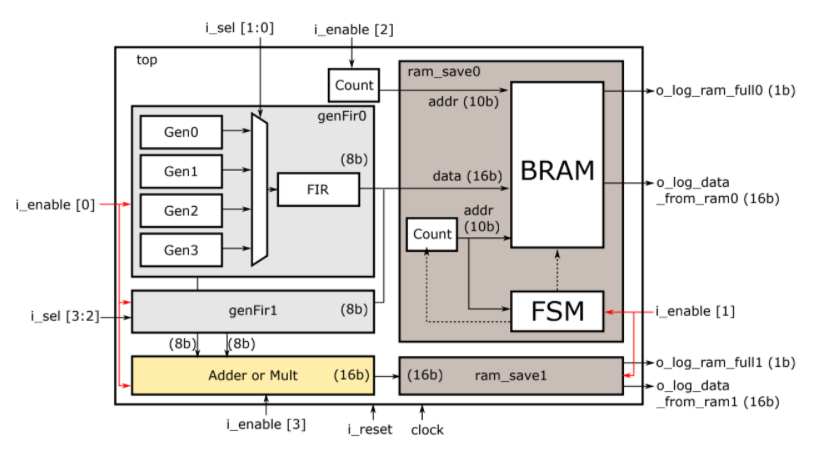

Los módulos [gen_fir](./gen_fir.v) y [ram_save](./ram_save.png) se implementaron igual que en el [laboratorio 3](../lab3-fir_bram).

La entrada de cada filtro FIR se obtiene del multiplexado de señales generadas a partir de archivos '.hex'. En el primer bloque BRAM con FSM se loguea la concatenación de señales filtradas: {dato1[7:0], dato0[7:0]} (16 bits). En el segundo se memoriza el resultado de la operación aritmética.

*i_sel[3:0]* consiste en enttradas de pulsadores, por lo que se considera su vuelta a reposo (modificación de estado con flanco ascendente). Dicha lógica se encuentra en el módulo [button_logic](./button_logic.v). *i_sel[1:0]* permite la selección de señal generadda por el primer *gen_fir0*, e *i_sel[3:2]* permite la selección de la señal generada por el módulo *gen_fir1*.

*i_enable[3:0]* consiste en entrada de switch.

- *i_enable[0]* permite la habilitación y deshabilitación de los módulos *gen_fir* y el módulo de operaciones ariteméticas *adder_mult*.
- *i_enable[1]* permite comenzar la escritura en ambos bloques *ram_save* (no se controlan de forma independiente).
- *i_enable[2]* habilita o deshabilita el contador de dirección de lectura en ambas BRAM, con lo que permite la lectura de las memorias.
- *i_enable[3]* permite la selección de operación aritmética a realizar, ya sea adición (0) o producto (1).

Como en el laboratorio 3, se tienen las mismas salidas asociadas a las memorias: *o_log_ram_full* flag que indica la escritua de la memoria completa, y *o_log_data_from_ram* que es el dato leído de la memoria.

**NOTA: Se consideró que los archivos hex se encuentran en formato punto fijo S(8, 6).**

### Diseño
A continuación se hace una breve descripción de los detalles más importantes de cada módulo diseñado.

#### Módulo [button_logic](./button_logic.v)
**Lógica de cambio de estado por flanco de subida de señal (pulsador).**

Ante cada flanco de subida de un pulsador, su estado asociado se conmuta. Ante un alto en la señal de reset, el estado de los pulsadores se coloca en bajo.

#### Módulo [adder_mult](./adder_mult.v)
**Operación aritmética (multiplicación o adición) entre dos datos de entrada.** Si la señal de enable se encuentra en 0 los datos se suman, si se encuentra en 1 se multiplica.

El módulo se plantea de tal forma de poder recibir datos de entrada con igual o distinto formato de punto fijo (siempre signado). Por lo tanto, la mayor dificultad en su implementación es la alineación genérica de la coma, con la correspondiente expansión de signo y completado con 0, necesario para efectuar correctamente la suma.

Es importante tener en cuenta el formato de punto fijo del resultado, ya que dependerá de los datos de entrada. En general, el resultado del producto tendrá una cantidad de bits fraccionales igual a la suma de los bits fraccionales de entrada, y el resultado de la suma tendrá una cantidad de bits fraccionales igual a la del dato de entrada con mayor cantidad de bits fraccionales.

También se debe tener en cuenta que al pasar como parámetro la cantidad de bits de salida, estos sean por lo menos suficientes para contener el resultado de la multiplicación, es decir, la suma de los bits de entrada. Luego el resultado de la suma, con una cantidad de bits igual (o un bit más) a la del dato de entrada con mayor cantidad de bits, se alineará con los bits menos significativos del puerto de salida.

#### Módulos [ram_save](./ram_save.v) y [gen_fir](./gen_fir.v)
El módulo *ram_save* es exactamente igual al utilizado en el laboratorio 3. El módulo *gen_fir* basicamente consiste en la interconexión del módulo de generación de señal con multiplexado y el módulo que implementa el filtro FIR.

### Simulación

Dado que el proyecto consiste en varios módulos, se decidió dividir la simulación para verificar el correcto funcionamiento del top en diferentes testbench.

Se implementó un testbench para evaluar el correcto funcionamiento de la lógica de pulsador ([tb_button_logic](./tb_button_logic.v)). A continuación se muestran los resultados de la simulación:

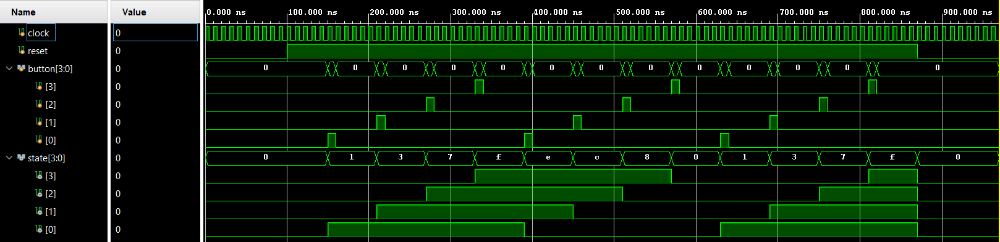

Luego, se escribió un testbench para el correcto funcionamiento del módulo de operación aritmética. Los resultados fueron los siguientes:

|Dato 0|Dato 1| Simulación (adición)                           |
|:----:|:----:|------------------------------------------------|
|S(8,6)|S(8,6)|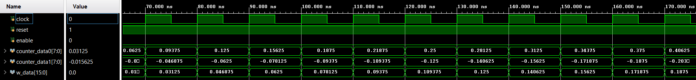|
|S(8,6)|S(5,3)|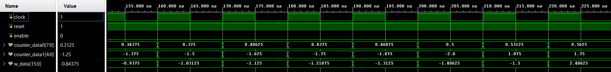|
|S(8,4)|S(6,5)|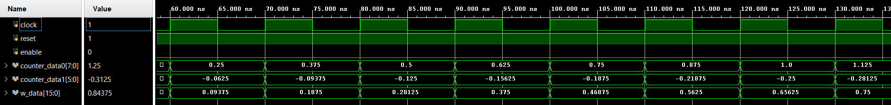|

|Dato 0|Dato 1| Simulación (producto)                           |
|:----:|:----:|-------------------------------------------------|
|S(8,6)|S(8,6)|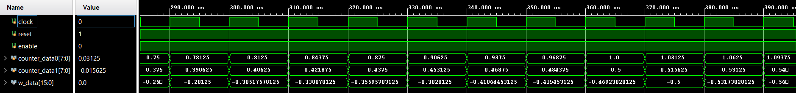|
|S(8,6)|S(5,3)|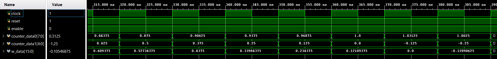|
|S(8,4)|S(6,5)|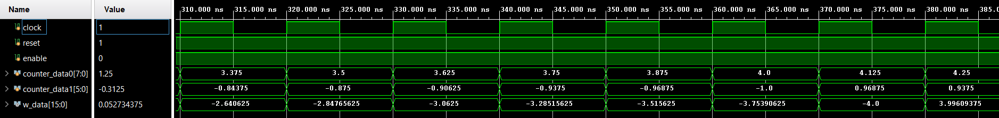|

**Recordar que el resultado se encuentra desfasado un pulso de clock de los datos de entrada.**

En el laboratorio 3, se implementó un testbench para el módulo *ram_save*, [tb_ram_save](./tb_ram_save.v), como en el trabajo no se módificó se lo considera funcionando correctamente. Sucede algo similar para el módulo *gen_fir*, se modificó el testbench del laboratorio anterior donde se testeaba generación y filtro como instancias separadas. En este caso se instanció directamente el módulo *gen_fir*, [tb_gen_fir](./tb_gen_fir.v), los resultados de la simulación se resumen en la siguiente imagen (iguales al laboratorio 3):

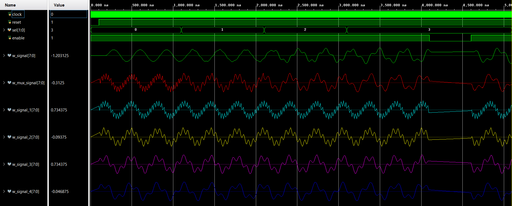

Por último, se escribió un testbench para la simulación del módulo top, que integra el resto de los módulos ([tb_top](./tb_top.v)). 

Las acciones del testbench son, luego de inicializar las entradas, quitar el estado de reset y habilitar la generación, filtrado y operación con señales. Luego, un bucle independiende va cambiando la señal seleccionada en cada módulo *gen_fir* cada determinado intervalo de tiempo, lo mismo (pero en un intervalo de tiempo mayor) con la entrada de selección entre suma o producto. Por último, otro bucle independiente habilita la escritura de las memorias, espera el flag de memoria llena y procede una lectura de ambas por un determinado intervalo de tiempo.

Para exponer los datos de la simulación de forma clara, fue necesario dividir tanto los datos de entrada a la primer memoria como los de salida en los 8 bits menos significativos y los 8 más significativos (recordar que la información se encuentra concatenada). En las siguientes imágenes se puede observar (señales analógicas) *w_data_ram0* señal de entrada a memoria, *log_data_from_ram0* datos leídos, en rojo los 8 bits menos significativos, en verde los 8 bits menos significativos. Además, en amarillo se puede observar el resultado de la operación aritmética entre las señales filtradas, y en magenta dicho resultado pero leído de la segunda memoria (*log_data_from_ram1*).

Los resultados fueron los iguientes:

- Bloque de operación aritmética con adición seleccionada:

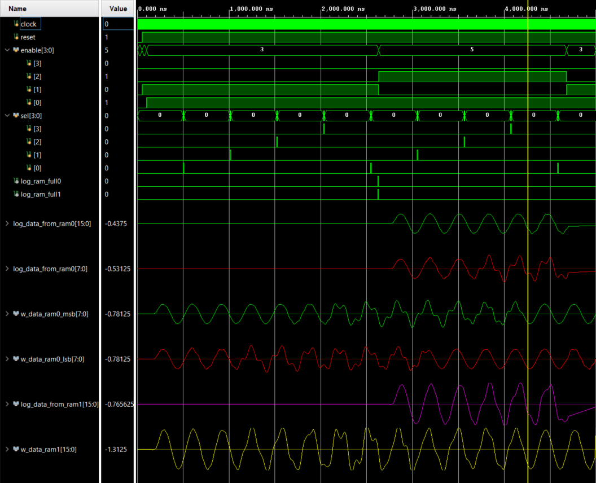

- Bloque de operación aritmética con multiplicación seleccionada:

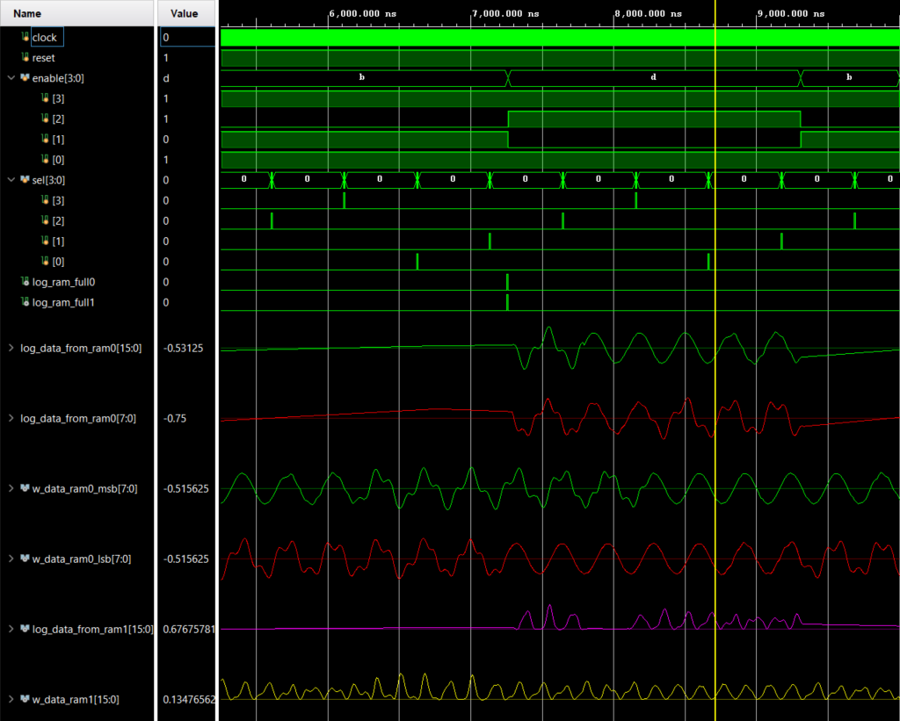

Todas las señales analógicas se encuentran escaladas entre -2 y 2, por lo que puede verificarse visualmente como la adición es del doble de amplitud de la señal original, y el resultado de la multiplicación tiene una amplitud menor (valor de señales originales menor que 1). Otra observación para verificar visualmente la multiplicación es cómo los resultados son solo positivos, ya que las señales de entrada coinciden en hemiciclos positivos y hemiciclos negativos. 

Otro punto importante a resaltar, es la necesidad de cambiar la configuración de punto fijo para visualizar correctamente la adición (6 bits fraccionales) y el producto (12 bits fraccionales).

### Síntesis

En la carpeta [synthesis](./synthesis) pueden encontrarse los reportes de síntesis y de utilización obtenidos al sintetizar el proyecto.

**Detalle de Celdas por Jerarquías:**

|      |Instance               |Module                             |Cells |
|:-----|:----------------------|:----------------------------------|-----:|
|1     |top                    |                                   |  2329|
|2     |> u_vio                |vio                                |     9|
|3     |> u_top                |top                                |  2318|
|4     |>>> gen_fir0           |gen_fir                            |  1059|
|5     |>>>>  u_fir_filter     |fir_filter_4                       |   397|
|6     |>>>>  u_signal_mux     |signal_mux_5                       |   662|
|7     |>>>>>   u_signal_gen_1 |signal_generator_6                 |   198|
|8     |>>>>>   u_signal_gen_2 |signal_generator__parameterized0_7 |   129|
|9     |>>>>>   u_signal_gen_3 |signal_generator__parameterized1_8 |   183|
|10    |>>>>>   u_signal_gen_4 |signal_generator__parameterized2_9 |   127|
|11    |>>> gen_fir1           |gen_fir_0                          |  1072|
|12    |>>>>  u_fir_filter     |fir_filter                         |   440|
|13    |>>>>  u_signal_mux     |signal_mux                         |   632|
|14    |>>>>>   u_signal_gen_1 |signal_generator                   |   168|
|15    |>>>>>   u_signal_gen_2 |signal_generator__parameterized0   |   129|
|16    |>>>>>   u_signal_gen_3 |signal_generator__parameterized1   |   183|
|17    |>>>>>   u_signal_gen_4 |signal_generator__parameterized2   |   127|
|18    |>>> ram_save0          |ram_save                           |    55|
|19    |>>>>  u_bram           |bram_2                             |     1|
|20    |>>>>  u_ram_fsm        |ram_fsm_3                          |     5|
|21    |>>> ram_save1          |ram_save_1                         |    45|
|22    |>>>>  u_bram           |bram                               |     1|
|23    |>>>>  u_ram_fsm        |ram_fsm                            |     5|
|24    |>>> u_adder_mult       |adder_mult                         |    54|
|25    |>>> u_sel_logic        |button_logic                       |    12|

El detalle de celdas puede observarse en detalle en el reporte de síntesis [top_vio_ila.vds](./synthesis/top_vio_ila.vds).

**Mapeo final de Block RAM:**

|Module Name              | RTL Object | PORT A (Depth x Width)  | W | R | PORT B (Depth x Width)  | W | R | Ports driving FF | RAMB18 | RAMB36 | 
|:------------------------|------------|-------------------------|---|---|-------------------------|---|---|------------------|--------|--------|
|u_top/\ram_save0/u_bram  | ram_reg    | 1 K x 16 (READ_FIRST)   | W |   | 1 K x 16 (WRITE_FIRST)  |   | R | Port A and B     | 1      | 0      | 
|u_top/\ram_save1/u_bram  | ram_reg    | 1 K x 16 (READ_FIRST)   | W |   | 1 K x 16 (WRITE_FIRST)  |   | R | Port A and B     | 1      | 0      |

Pueden observarse las dos BRAM utilizadas en el proyecto.

**Mapeo preliminar de DSP:**

|Module Name | DSP Mapping                 | A Size | B Size | C Size | D Size | P Size | AREG | BREG | CREG | DREG | ADREG | MREG | PREG | 
|------------|-----------------------------|--------|--------|--------|--------|--------|------|------|------|------|-------|------|------|
|fir_filter  | (A''*(B:0x3ffff))'          | 8      | 1      | -      | -      | 9      | 2    | 0    | -    | -    | -     | 1    | 0    | 
|fir_filter  | (ACIN''*(B:0x3ffff))'       | 8      | 1      | -      | -      | 9      | 2    | 0    | -    | -    | -     | 1    | 1    | 
|fir_filter  | (A''*(B:0xd))'              | 8      | 5      | -      | -      | 13     | 2    | 0    | -    | -    | -     | 1    | 0    | 
|top         | (PCIN+(ACIN2*(B:0x8))')'    | 8      | 5      | -      | -      | 17     | 1    | 0    | -    | -    | -     | 1    | 1    | 
|fir_filter  | (C:0x0)'+(ACIN2*(B:0x3))'   | 8      | 3      | 16     | -      | 17     | 1    | 0    | 1    | -    | -     | 1    | 1    | 
|top         | PCIN+A:B                    | 30     | 18     | -      | -      | -1     | 0    | 0    | -    | -    | -     | 0    | 0    | 
|fir_filter  | (C:0x0)'+(A''*(B:0x3ffff))' | 8      | 1      | 16     | -      | 17     | 2    | 0    | 1    | -    | -     | 1    | 1    | 
|top         | (C'+(ACIN''*(B:0x3))')'     | 8      | 3      | 13     | -      | 17     | 2    | 0    | 1    | -    | -     | 1    | 1    | 
|top         | (ACIN''*(B:0xd))'           | 8      | 5      | -      | -      | 13     | 2    | 0    | -    | -    | -     | 1    | 0    | 
|fir_filter  | (PCIN+(A''*(B:0x10))')'     | 8      | 6      | -      | -      | 17     | 2    | 0    | -    | -    | -     | 1    | 1    | 
|top         | PCIN+A:B                    | 30     | 18     | -      | -      | -1     | 0    | 0    | -    | -    | -     | 0    | 0    | 
|fir_filter  | (A''*(B:0x3ffff))'          | 8      | 1      | -      | -      | 9      | 2    | 0    | -    | -    | -     | 1    | 0    | 
|fir_filter  | (ACIN''*(B:0x3ffff))'       | 8      | 1      | -      | -      | 9      | 2    | 0    | -    | -    | -     | 1    | 1    | 
|fir_filter  | (A''*(B:0xd))'              | 8      | 5      | -      | -      | 13     | 2    | 0    | -    | -    | -     | 1    | 0    | 
|top         | (PCIN+(ACIN2*(B:0x8))')'    | 8      | 5      | -      | -      | 17     | 1    | 0    | -    | -    | -     | 1    | 1    | 
|fir_filter  | (C:0x0)'+(ACIN2*(B:0x3))'   | 8      | 3      | 16     | -      | 17     | 1    | 0    | 1    | -    | -     | 1    | 1    | 
|top         | PCIN+A:B                    | 30     | 18     | -      | -      | -1     | 0    | 0    | -    | -    | -     | 0    | 0    | 
|fir_filter  | (C:0x0)'+(A''*(B:0x3ffff))' | 8      | 1      | 16     | -      | 17     | 2    | 0    | 1    | -    | -     | 1    | 1    | 
|top         | (C'+(ACIN''*(B:0x3))')'     | 8      | 3      | 13     | -      | 17     | 2    | 0    | 1    | -    | -     | 1    | 1    | 
|top         | (ACIN''*(B:0xd))'           | 8      | 5      | -      | -      | 13     | 2    | 0    | -    | -    | -     | 1    | 0    | 
|fir_filter  | (PCIN+(A''*(B:0x10))')'     | 8      | 6      | -      | -      | 17     | 2    | 0    | -    | -    | -     | 1    | 1    | 
|top         | PCIN+A:B                    | 30     | 18     | -      | -      | -1     | 0    | 0    | -    | -    | -     | 0    | 0    | 

**Reporte de Shift Register estáticos:**

|Module Name | RTL Name                                 | Length | Width | Reset Signal | Pull out first Reg | Pull out last Reg | SRL16E | SRLC32E | 
|:-----------|:-----------------------------------------|--------|-------|--------------|--------------------|-------------------|--------|---------|
|top         | gen_fir1/u_fir_filter/register_reg[5][7] | 4      | 16    | YES          | NO                 | YES               | 16     | 0       | 
|top         | gen_fir0/u_fir_filter/register_reg[5][7] | 4      | 16    | YES          | NO                 | YES               | 16     | 0       |

Puede observarse que los shift register se utilizan en la síntesis de los filtros FIR.
